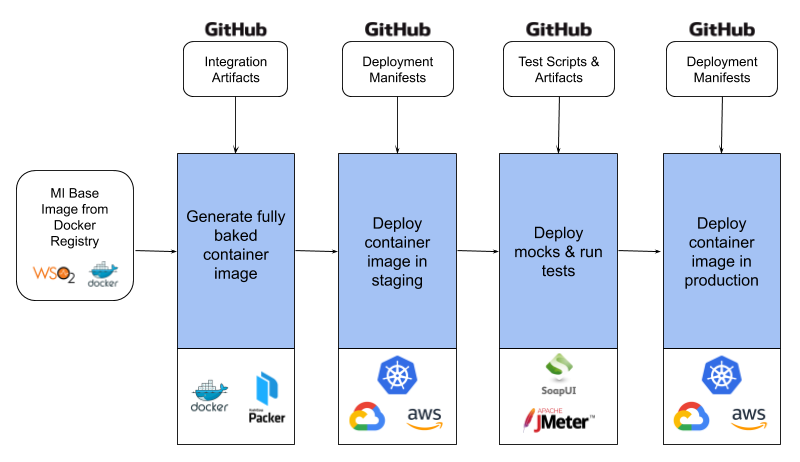

# WSO2 Micro Integrator

[](https://wso2.org/jenkins/job/products/job/micro-integrator/)
[](https://opensource.org/licenses/Apache-2.0)
[](https://wso2-ei.slack.com/messages/microintegrator/)


WSO2 Micro integrator is a open-source, lightweight, fast,
scalable, and distributed microservice integration layer which is the
cloud-native distribution of [WSO2 Enterprise Integration
(EI)](https://wso2.com/integration/)

## Summary

- [**Why Micro Integrator?**](#why-micro-integrator?)
- [**Getting Started**](#getting-started)
- [**Contributing**](#contributing)
- [**Enterprise Support & Demo**](#enterprise-support--demo)
- [**Licence**](#licence)
- [**Copyright**](#copyright)

## Why Micro Integrator?

WSO2 Micro Integrator is built for developers who would like to
integrate microservices and cloud native architectures using a
configuration-driven approach. The Micro Integrator gives developers
the best possible experience for developing, testing, and deploying
integrations and tooling.

The Micro integrator developer experience is especially tuned for,
- Integration developers who prefer config driven approach.
- People who are looking for a solution to make their brownfield (ie.
  legacy systems) integrated into their new microservices based
  solutions.
- Existing WSO2 EI and integration middleware users who want to move
  into cloud native or Micro services architecture.

The Micro Integrator also provides an enhanced experience for those
using a container-based architecture and works natively on the Kubernetes
ecosystem and it makes deployment with Docker a simple process. Following
are the main design objectives for developing the Micro Integrator.
- Lightweight and optimized runtime based on the same integration
  runtime of EI.
- Native support for Docker and Kubernetes.
- Flawless developer experience for developing, testing and deploying
  integrations and tooling.
- Integrate natively with cloud native ecosystem projects.
- Building a runtime suitable for hybrid integration requirements
  (integration cloud).

### Micro Integrator CI/CD workflow



## Getting Started

Please refer to the instructions on the installation of, and working with, the Micro Integrator by visiting the documentation for
[Working with the Micro Integrator](doc/working-with-the-micro-integrator.md).
You can also try out on a simple scenario of forwarding a request to a service by following the documenation on [Getting Started.](examples/getting-started/README.md)

## Contributing

If you are planning on contributing to the development efforts of WSO2 Micro Integrator, you can do that by checking out
the latest development version. The `master` branch holds the latest unreleased source code.

### Building from the source

Please follow the steps below to build WSO2 Micro Integrator from source code.

1. Clone or download the source code from this repository (https://github.com/wso2/micro-integrator).
2. Run the maven command `mvn clean install` from the root directory of the repository.
3. The generated Micro Integrator distribution can be found at `micro-integrator/distribution/target/wso2mi-<version>.zip`.

#### Building the Docker image

You can build the Docker image for Micro Integrator by setting the system property `docker.skip` to `false` when running
maven build. This builds and pushes the micro-integrator Docker image to the local Docker registry.

```bash
mvn clean install -Ddocker.skip=false
```

## Enterprise Support & Demo

If you are looking for enterprise level support for the solutions you develop using WSO2 Micro Integrator please visit
https://wso2.com/integration/.

## License

WSO2 Micro Integrator is licensed under the [Apache License](http://www.apache.org/licenses/LICENSE-2.0).

## Copyright

(c) 2018, [WSO2 Inc.](http://www.wso2.org) All Rights Reserved.

